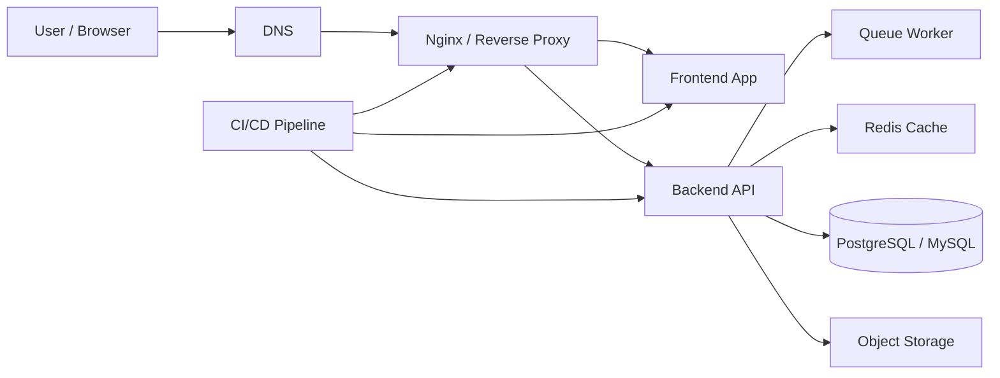

# VPS Operations Handbook

Panduan operasional VPS dari basic sampai advanced, disusun seperti handbook agar mudah dipakai sebagai referensi harian.

**Keywords:** VPS, Linux Server, Ubuntu, Debian, Nginx, Docker, DevOps, Deployment, Backend, Frontend, Laravel, Next.js, FastAPI, Security, Monitoring, Backup

**Hashtags:** #vps #linux #ubuntu #debian #nginx #docker #devops #deployment #backend #frontend #laravel #nextjs #fastapi #security #monitoring #backup

## Mulai dari Sini

- Baru setup server? Baca [01. Foundation](./01-foundation.md) lalu [02. Initial Setup](./02-initial-setup.md)
- Mau hardening? Lanjut ke [03. Security Hardening](./03-security-hardening.md)
- Mau deploy web app? Lihat [05. Nginx and Reverse Proxy](./05-nginx.md)
- Mau pilih stack spesifik? Buka [19. Specific Stack Guides](./19-specific-stacks.md)

## Peta Dokumen

| Bagian | Topik |
|---|---|
| 01 | [Foundation](./01-foundation.md) |
| 02 | [Initial Setup](./02-initial-setup.md) |
| 03 | [Security Hardening](./03-security-hardening.md) |
| 04 | [Network, DNS, and SSL](./04-network-dns-ssl.md) |
| 05 | [Nginx and Reverse Proxy](./05-nginx.md) |
| 06 | [Frontend Deployment](./06-frontend.md) |
| 07 | [Backend Deployment](./07-backend.md) |
| 08 | [Full Stack Deployment](./08-fullstack.md) |
| 09 | [Database, Cache, Queue, Storage](./09-data-layer.md) |
| 10 | [Docker and Docker Compose](./10-docker.md) |
| 11 | [CI/CD and Automation](./11-cicd.md) |
| 12 | [Monitoring and Logging](./12-monitoring.md) |
| 13 | [Backup and Recovery](./13-backup.md) |
| 14 | [Maintenance Routine](./14-maintenance.md) |
| 15 | [Advanced Production Patterns](./15-advanced.md) |
| 16 | [Troubleshooting](./16-troubleshooting.md) |
| 17 | [Production Checklists](./17-checklists.md) |
| 18 | [Command Cheat Sheet](./18-cheatsheet.md) |
| 19 | [Specific Stack Guides](./19-specific-stacks.md) |
| 20 | [Frontend Stack](./20-frontend-stack.md) |
| 21 | [Backend Stack](./21-backend-stack.md) |
| 22 | [Docker Stack](./22-docker-stack.md) |
| 23 | [Laravel Stack](./23-laravel-stack.md) |
| 24 | [Next.js Stack](./24-nextjs-stack.md) |
| 25 | [FastAPI Stack](./25-fastapi-stack.md) |
| 26 | [Architecture Diagram](./26-architecture.mmd) |

## Arsitektur Referensi

Diagram versi file ada di [26-architecture.mmd](./26-architecture.mmd).

## Cara Pakai

1. Baca berurutan kalau kamu benar-benar baru.
2. Kalau tujuanmu spesifik, langsung lompat ke guide stack yang relevan.
3. Untuk production, jadikan checklist, backup, dan troubleshooting sebagai referensi rutin.

## GitHub Pages

Landing page GitHub Pages tersedia di [index.md](./index.md).

## Catatan

Dokumentasi ini diasumsikan untuk Ubuntu Server / Debian-based Linux.
Jika kamu memakai distro lain, beberapa path atau nama service bisa berbeda.
